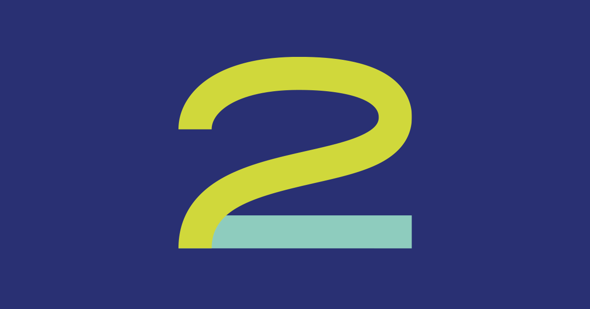

tags:: 2017

- 
-
- ## Какой процесс объединяет всех
	- Например, процесс разрушения — энтропия, старение, приход в упадок. То дети болеют, то машина ломается, то ботинки промокают — такое случается. События могут выбивать из колеи, тащить не туда, напрягать — это нормально.
	- Если у человека были цели и ожидания, то отклонение от плана вызовет расстройство. А если принять во внимание, что процесс достижения цели нелинейный, а цели могут меняться, тогда и переживать попроще.
	- Когда что-то неприятное все-таки происходит, более продуктивно думать о том, что можно сделать *сейчас*. Бывает в рабочей почте сразу после чьей-то ошибки возникает вопрос: кто? Кто сделал, кто виноват, кто принял неверное решение. Я думаю, что такой вопрос может быть десятым, сотым, тысячным, а не первым, потому что в момент самого события найти виноватого не так важно.
	- Как-то жена на мой ноутбук пролила воду, и клавиатура стала барахлить. Я расстроился, но она подловила моим же методом, говоря, что это состоявшийся факт, давай думать, что можно сделать. И сразу как-то отлегло.
	- Классно уметь иногда отдалиться от ситуации, суметь сконцентрироваться на перспективе и на пути. Помогает преодолевать неприятности в моменте.
- ## Что выдает с головой
	- Я убежден, что к годам 30 люди формулируют мысли на основе прижившихся предубеждений, нерешенных травм, любимых когнитивных искажений. Если задать один и тот же вопрос разным людям, то их ответы раскроют самого говорящего. Например, если спросить, стоит ли менять работу, можно будет услышать:
		- 1. Беги изо всех сил, ищи место, где тебя будут ценить!
		- 2. Зачем уходить, а где будет лучше? Неужели тебе прямо так плохо на старом месте?
		- 3. Слушай, а попробуй поговорить с начальством, возьми проекты побольше, разведи активность, пусть тебя заметят!
	- Такие советы, безусловно, имеют право на существование, но они лишь отражают собственные намерения говорящего. Под каждый совет можно найти подтверждения в статьях и книгах, но ни один совет не скажет, что же нужно делать на самом деле.
	- Так, на этой неделе в чатах и разговорах мои непрошенные советы часто содержали слово «смелость»: это несмелое решение, это смелое решение, будем действовать смелее. Осознал, записал в заметки — думаю, что же это значит.
	- Например то, что смелость — оборотная сторона уязвимости. Посмотрите об этом выступление на TED:
	- [Брене Браун — Сила уязвимости](https://www.ted.com/talks/brene_brown_the_power_of_vulnerability?language=ru) (20 минут, русские субтитры) #videos
- ## Действия, не слова
	- Я мечтал о своей мейл-рассылке уже около года. Я думал, что мне нечего сказать. Я анализировал и планировал, искал темы и просил советов у гуру. Я получал советы из позиций и голов тех, кто мне отвечал. И чужие ответы мне не помогали.
	- Что страшного случится, если просто начать? Что страшного случится, если эти тексты прочитают знакомые и тем более незнакомые?
	- Действия, а не слова определяют наши ценности, как пишет [[Дерек Сиверс]]:
	- [Derek Sivers — Actions, not words, reveal our real values](https://sive.rs/arv) #gems
	- Клавиша пробела на ноутбуке после пролитой воды все еще залипает. Несмелость завтра скажет не отправлять это письмо, поэтому отправляю сейчас.