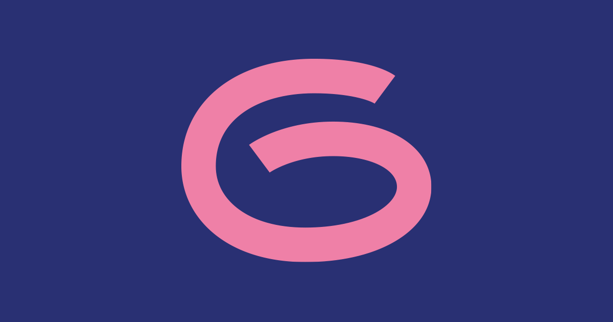

tags:: 2018

- 
	-
- Хороший вопрос содержит половину ответа. Нужно хорошенько постараться, чтобы задать жирный, не-в-бровь-а-в-глаз, уместный, точный, действенный вопрос. Подготовиться, рассмотреть проблему, предположить, что даст ответ. Какие вопросы бывают:
- ## Лишние
	- Нужно ли задавать вопрос-разрешение или можно сразу рассказать всю идею и начать делать? Нужно ли задавать такой вопрос, ответ на который не прояснит ситуацию, не удовлетворит любопытство, не подскажет, что делать дальше? Нужно ли задавать вопрос, чтобы проявить формальный интерес? Сложно построить разговор на вопросах.
- ## Вовремя
	- Если мы решаем, как именно делаем задачу, то время вопросов, делать ли задачу ушло — задача в производстве. Если мы на стадии, почему мы будем это делать, то время вопросов, как будем делать, еще не настало — задача не определена.
- ## Резонансные
	- Иногда спросить стоит для того, чтобы поймать чувство своей реакции на ответ. Допустим, где-то внутри положительный ответ уже есть, тогда подтверждение вызовет радость, а отрицание подкинет еще аргументов. Но если осознать, что только подтверждение и ищешь, то уже не надо спрашивать. «Как думаешь, делать ли мне рассылку?»
- ## Конкретные
	- Полезно описать вводные условия, которые сформировали вопрос. Если мы делаем так, если известно это, если настало время икс, тогда как и почему произойдет игрек? Такой вопрос двигает вперед, если вводные верны и правильно поняты, а также позволяет подвергнуть сомнению сами вводные, если вопрос, к которому мы пришли, звучит нелепо.
- ## Открытые
	- После обсуждения здорово спросить — что я еще упускаю? что вам кажется важным? есть ли что-то добавить?
- ## Парализующие
	- В какой-то момент надо решить самостоятельно, принимать решения, разобраться, нагуглить ответ, разузнать, выяснить и двигаться вперед к новым вопросам. Неотвеченный непринципиальный вопрос не должен тормозить процесс. «Так что решили, чтобы я мог дальше делать?»
- ## Направляющие
	- Чтобы помочь посмотреть на вопрос с другой стороны. Или чтобы проверить ход мысли, особенно когда знаешь ответ. «Может, попробовать не верстать, а запилить картинкой? Сработает?»
- ## Вопросы на каждый день
	- Зачем я делаю сейчас то, что делаю? Нужно ли делать это сейчас? Что не нужно делать сейчас? Чем я могу быть наиболее полезен сейчас? Какая одна вещь может сейчас дать лучший результат? Какой критерий, что нужно остановиться это делать?
	- Какой процесс нужно запустить или поддержать сейчас, чтобы его результат вовремя созрел? Что меня беспокоит на самом деле? Что может пойти не так? Каким может быть худший исход? Так ли это страшно?
	- Откуда я знаю то, что кажется очевидным? Кто может знать лучше и помочь?
	- Что я чувствую? Почему?
	- Что бы ты делал, если бы не боялся?